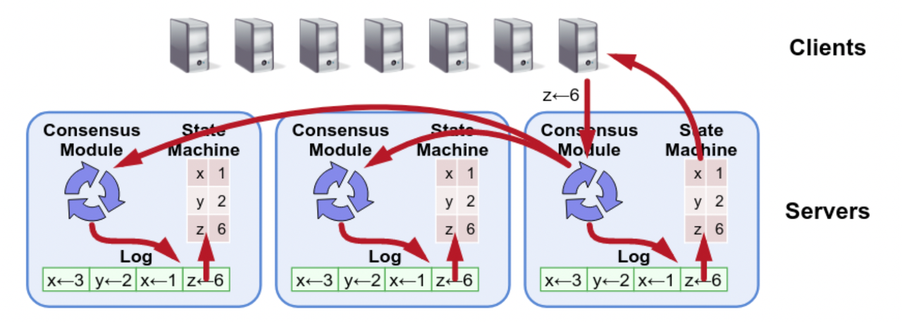
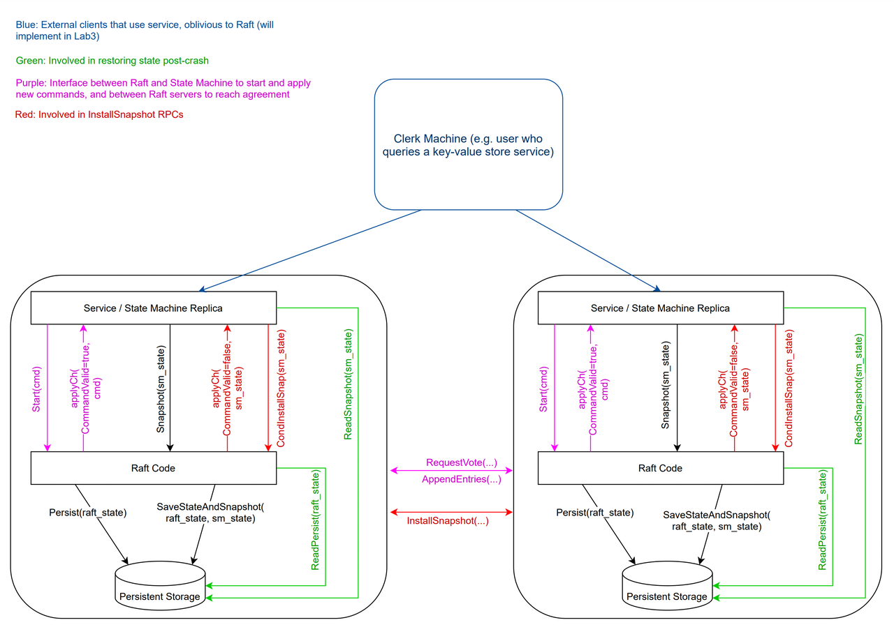

在前面的第一部分的学习中，大家已经对分布式大致理论、分布式共识算法有了基本的认识，并且已经完整的实现了 raft 的各个重要组成部分，学习到了很多关于分布式系统的基本概念以及代码实践。

接下来，就要在实践中更进一步，基于前面实现的 raft 算法，去构建一个高可用的分布式 Key/Value 服务，通过这一部分的学习，你将会真正的将 raft 使用起来，这不仅可以帮助你在更深的维度去理解分布式理论、raft 共识算法，并且让你对生产环境中的高可用、容错的项目有具体的实践经验。

## 大致架构

我们需要构建的分布式 KV 服务是什么样的架构？

我们的分布式 KV 服务将会是一个复制状态机，由几个使用 raft 进行状态复制的 kv 服务节点组成。分布式 KV 服务需要保证在集群大多数节点正常的情况下依然能够正常提供服务，即使有一些其他的错误或者网络分区。



大致的流程是客户端向后端的 servers 发起请求，后端的服务是由多个节点组成的，每个节点之间使用 raft 进行状态复制，客户端会选择将请求发送到 Leader 节点，然后由 Leader 节点进行状态复制，即发送日志，当收到多数的节点成功提交日志的响应之后，Leader 会更新自己的 commitIndex，表示这条日志提交成功，并且 apply 到状态机中，然后返回结果给客户端。

在这一个分布式 KV 部分完成之后，加上前面已经实现了的 raft 部分，我们就基本实现了下图中提到的每一个部分（这个图可能大家在前面的学习中已经看到过了，主要包含了 raft 的一些主要方法的状态转换和基于 raft 的 KV 服务的交互，https://pdos.csail.mit.edu/6.824/notes/raft_diagram.pdf）：



## 代码框架

**需要切换到 example 分支！**

在我们的课程中，分布式 KV 部分主要是在目录 kvraft 中，大致包含客户端和服务端的逻辑。

客户端是由一个叫 Clerk 的结构体进行表示的，它主要是维护了客户端发送请求到后端 KV 服务的逻辑。

```Rust
type Clerk struct {
   servers []*labrpc.ClientEnd
   // You will have to modify this struct.
}
```

Clerk 会向 KV 服务发送三种类型的请求：

- Get：通过 key 获取 value
- Put：设置 key/value 对
- Append：将值追加到 key 对应的 value 上，如果 key 不存在，则相当于 Put

需要注意的是我们的 Get/Put/Append 方法需要保证是具有线性一致性的。线性一致性简单来说是要求客户端的修改对后续的请求都是生效的，即其他客户端能够立即看到修改后的结果，而不会因为我们的多副本机制而看到不一样的结果，最终的目的是要我们的 kv 服务对客户端来说看起来“像是只有一个副本”。

服务端的代码主要是在 server.go 中，结构体 KVServer 描述了一个后端的 kv server 节点所维护的状态：

```Rust
type KVServer struct {
   mu      sync.Mutex
   me      int
   rf      *raft.Raft
   applyCh chan raft.ApplyMsg
   dead    int32 // set by Kill()

   maxraftstate int // snapshot if log grows this big

   // Your definitions here.
}
```

可以看到 KVServer 维护了一个 raft 库中的 Raft 结构体，表示其是一个 raft 集群中的节点，它会通过 raft 提供的功能向其他的 KVServer 同步状态，让整个 raft 集群中的数据保持一致。

## 参考链接

https://pdos.csail.mit.edu/6.824/labs/lab-kvraft.html

https://mp.weixin.qq.com/s/ss6VV2nARjHhEZVFKg0vrQ

https://www.sofastack.tech/projects/sofa-jraft/consistency-raft-jraft/